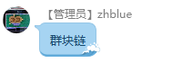

README.md
---------

- version: 200108

Scavenger Cloud - 垃圾佬云
--------------------------

Scavenger Cloud - 垃圾佬云. 这个冬天太寒冷, 为了提升家里的室温, 广大垃圾佬决定贡献自己的CPU为大家提供算力, 顺便利用CPU取暖.  
垃圾佬云最终的目的是建立一个群体共有的利用虚拟货币计费的私有云.

Step 1
------

## 任务:
- @karminski-牙医 负责搭建初期 k8s 集群
- @karminski-牙医 贡献 8 core 16G 虚拟机 x 5
- @(实习)七月毕业 冯 负责调研网络方案

## 集群搭建进度 :

- 初始化虚拟机 []
- 部署 k8s master 在 @karminski-牙医 本地
- 部署 etcd 在 @karminski-牙医 本地
- 部署 worker node 在 @karminski-牙医 本地
- 部署 k8s master 在 @(实习)七月毕业 冯 本地
- 部署 etcd 在 @(实习)七月毕业 冯 本地
- 部署 worker node 在 @(实习)七月毕业 冯 本地
- 测试集群
- 给大家访问权限公测

## 可调研网络方案如下:

| 方案       | 优点                 | 缺点               | 是否作为中标方案 |
|------------|----------------------|--------------------|------------------|
| vpn + bgp  |                      |                    |                  |
| zerotier   |                      |                    |                  |
| wg         |                      |                    |                  |
| tinc       |                      |                    |                  |
| nebula     |                      |                    |                  |

Step 2
------

- 待定

Step 3
------

- 待定